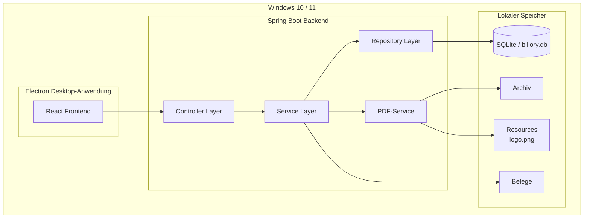
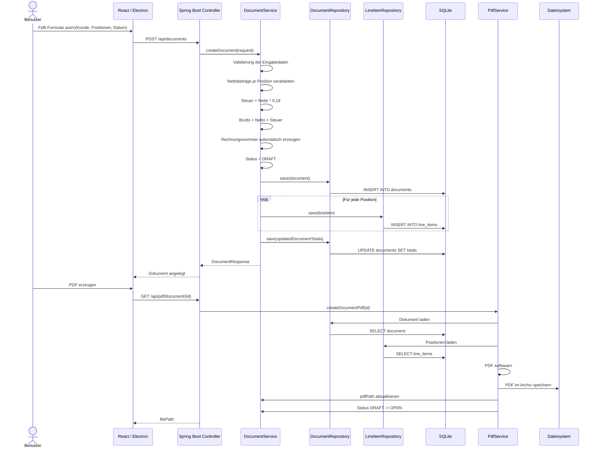
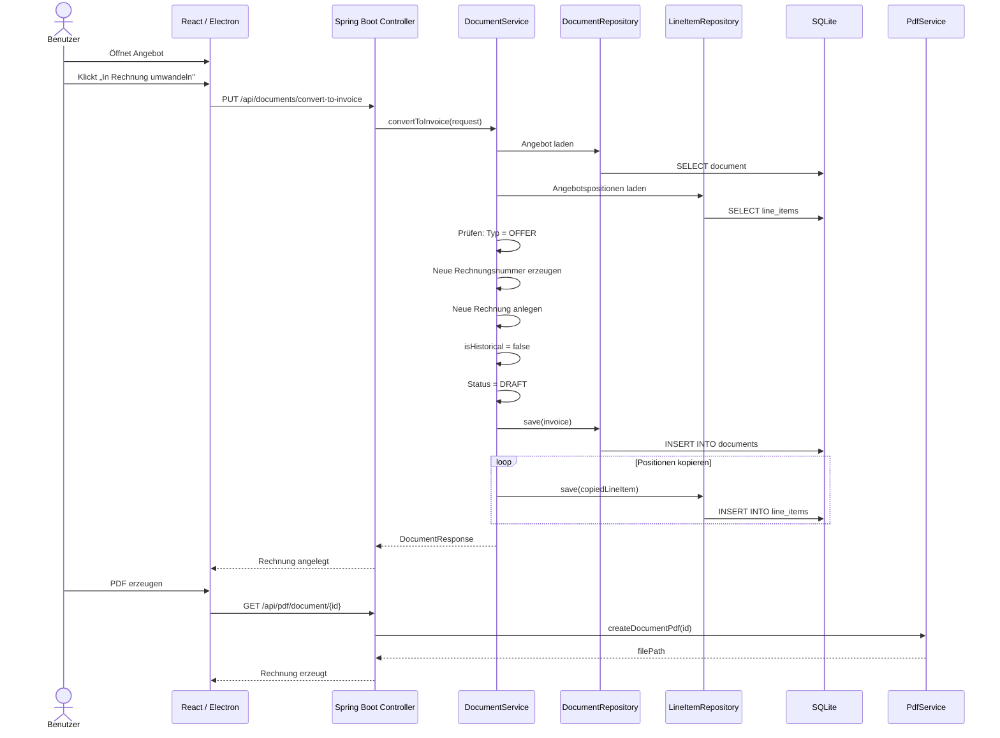
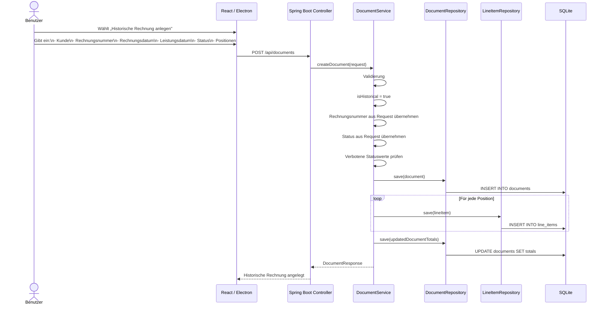
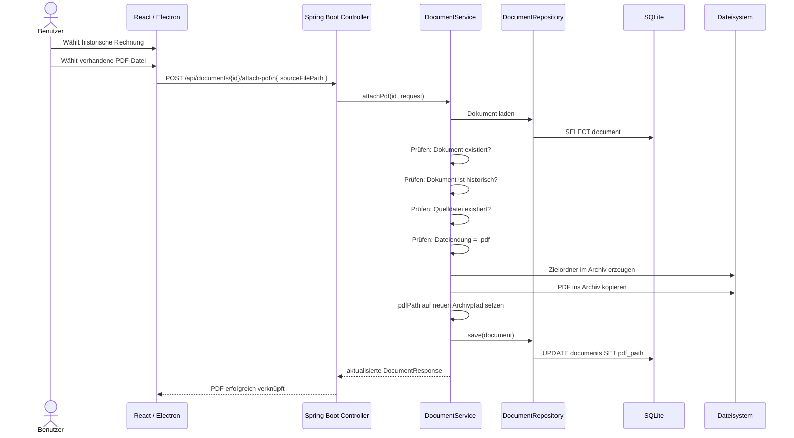
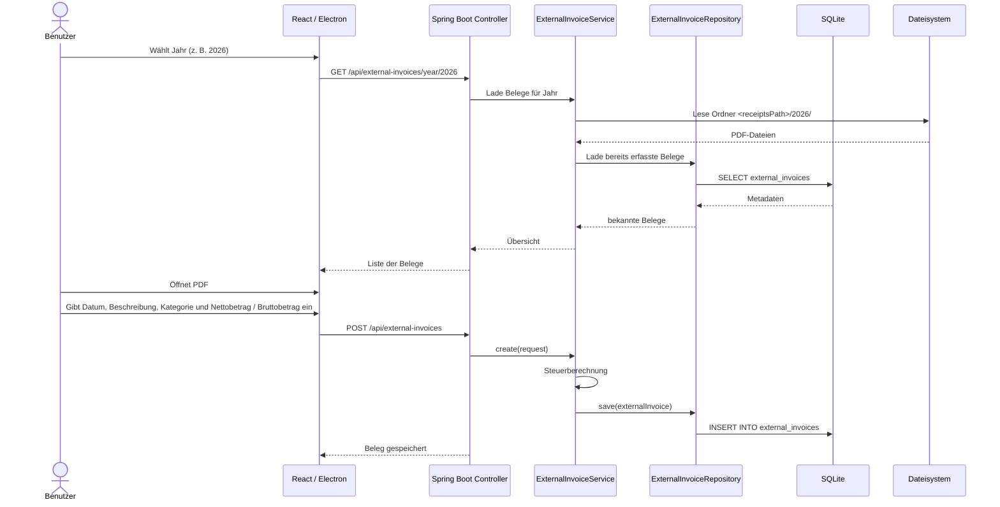

# Architekturdiagramme
## Rechnungs- und Angebotssoftware – Baum Performance Stahl

**Version:** 2.0  
**Stand:** April 2026  

---

## Inhaltsverzeichnis

1. [Systemarchitektur – Gesamtübersicht](#1-systemarchitektur--gesamtübersicht)
2. [Datenfluss – Rechnung erstellen](#2-datenfluss--rechnung-erstellen)
3. [Datenfluss – Angebot zu Rechnung konvertieren](#3-datenfluss--angebot-zu-rechnung-konvertieren)
4. [Datenfluss – Historische Rechnung übernehmen](#4-datenfluss--historische-rechnung-übernehmen)
5. [Datenfluss – Vorhandenes PDF an historisches Dokument anhängen](#5-datenfluss--vorhandenes-pdf-an-historisches-dokument-anhängen)
6. [Datenfluss – Externe Belege (geplant)](#6-datenfluss--externe-belege-geplant)

---

## 1 Systemarchitektur – Gesamtübersicht

Das Diagramm zeigt die aktuelle Systemarchitektur der Anwendung auf Basis von React, Electron und einem Spring-Boot-Backend.

### Erläuterung der Schichten

| Schicht | Technologie | Aufgabe |
|---|---|---|
| Frontend | React + TypeScript | Benutzeroberfläche, Formulare, Tabellen |
| Desktop-Hülle | Electron | Lokale Desktop-Anwendung |
| Backend API | Spring Boot (Java 21) | REST-API, Validierung, Geschäftslogik |
| Service Layer | Spring Services | Berechnungen, Nummerierung, Statuslogik, PDF-Handling |
| Repository Layer | Spring Data JPA / Hibernate | Datenbankzugriffe auf SQLite |
| Datenbank | SQLite | Lokale Speicherung aller Anwendungsdaten |
| PDF-Service | OpenPDF | Erzeugung von Angebots- und Rechnungs-PDFs |
| Migrationen | Flyway | Versionierung und Aufbau des Schemas |
| Dateisystem | Java NIO | Archivierung erzeugter und verknüpfter PDFs |

---

## 2 Datenfluss – Rechnung erstellen

Vom Speichern einer normalen Rechnung bis zur PDF-Erzeugung.

### Fachliche Regeln

- Normale Rechnungen erhalten ihre Rechnungsnummer automatisch.
- Neue Rechnungen starten immer mit Status `DRAFT`.
- Erst bei erfolgreicher PDF-Erzeugung wird ein `DRAFT` automatisch zu `OPEN`.
- Positionswerte werden als **Nettobeträge** eingegeben.
- Umsatzsteuer und Bruttobetrag werden automatisch berechnet.

---

## 3 Datenfluss – Angebot zu Rechnung konvertieren

Ein bestehendes Angebot wird in eine neue Rechnung überführt.

### Fachliche Regeln

- Nur Dokumente vom Typ `OFFER` dürfen konvertiert werden.
- Die neue Rechnung erhält eine neue automatische Rechnungsnummer.
- Die konvertierte Rechnung ist **kein** historisches Dokument.
- Die Positionsdaten werden aus dem Angebot übernommen.

---

## 4 Datenfluss – Historische Rechnung übernehmen

Bereits existierende Kundenrechnungen können manuell nachträglich ins System übernommen werden.

### Fachliche Regeln

- Historische Rechnungen verwenden eine **manuell vorgegebene Rechnungsnummer**.
- Historische Rechnungen sind keine Entwürfe.
- Für historische Rechnungen ist `DRAFT` nicht erlaubt.
- Historische Rechnungen dürfen direkt z. B. als `OPEN` oder `PAID` angelegt werden.
- Historische Rechnungen zählen nicht zur automatischen neuen Rechnungsnummernvergabe.

---

## 5 Datenfluss – Vorhandenes PDF an historisches Dokument anhängen

Ein bereits vorhandenes PDF wird einem historischen Dokument zugeordnet und ins Archiv kopiert.

### Fachliche Regeln

- Das Anhängen eines vorhandenen PDFs ist **nur** bei historischen Dokumenten erlaubt.
- Die Quelldatei wird nicht nur referenziert, sondern in das eigene Archiv kopiert.
- Gespeichert wird der neue Archivpfad im Feld `pdfPath`.
- Das Original kann z. B. aus Downloads, Desktop oder einem alten Ordner stammen.

---

## 6 Datenfluss – Externe Belege (geplant)

> Hinweis: Dieser Ablauf ist fachlich vorgesehen, im aktuellen Backend-Stand jedoch noch nicht umgesetzt.

### Ziel des Moduls

- Externe Eingangsrechnungen und Belege verwalten
- PDFs innerhalb der Anwendung anzeigen
- Beträge für steuerliche Auswertung erfassen
- Jahresübersichten und Exporte bereitstellen

---

*Version 2.0 · Stand: April 2026 · Baum Performance Stahl*
