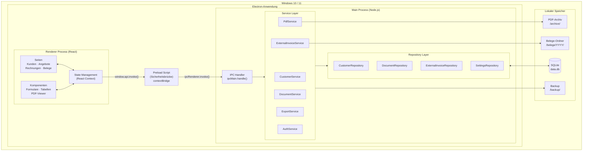
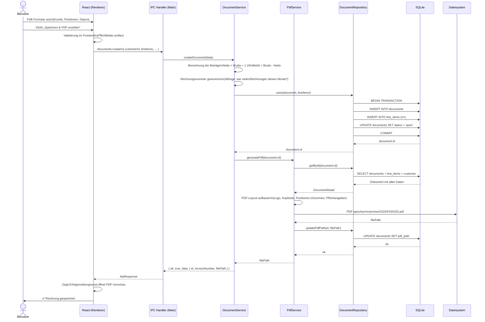
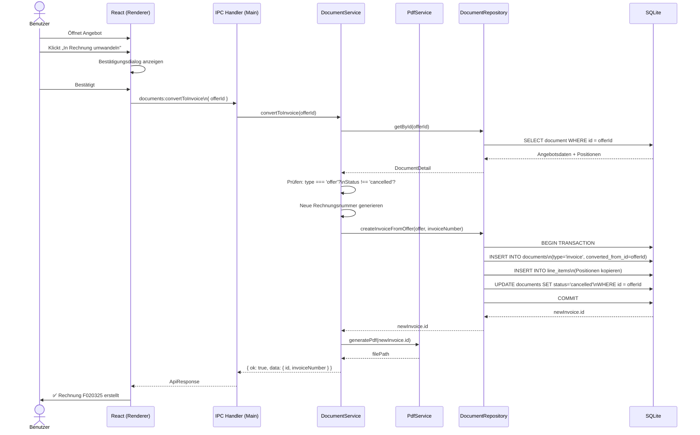
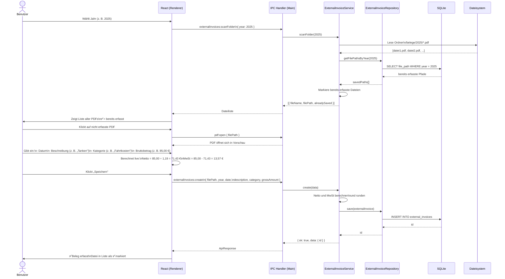

# Architekturdiagramme
## Rechnungs- und Angebotssoftware – Baum Performance Stahl

**Version:** 1.0  
**Stand:** März 2025  

---

## Inhaltsverzeichnis

1. [Systemarchitektur – Gesamtübersicht](#1-systemarchitektur--gesamtübersicht)
2. [Datenfluss – Rechnung erstellen](#2-datenfluss--rechnung-erstellen)
3. [Datenfluss – Angebot zu Rechnung konvertieren](#3-datenfluss--angebot-zu-rechnung-konvertieren)
4. [Datenfluss – Externen Beleg erfassen](#4-datenfluss--externen-beleg-erfassen)

---

## 1 Systemarchitektur – Gesamtübersicht

Das Diagramm zeigt alle Schichten der Anwendung und wie sie miteinander kommunizieren.

### Erläuterung der Schichten

| Schicht | Technologie | Aufgabe |
|---|---|---|
| **Renderer Process** | React + TypeScript | Benutzeroberfläche, Formulare, Ansichten |
| **Preload Script** | Electron contextBridge | Sicherheitsschicht zwischen UI und Backend |
| **IPC Handler** | Electron ipcMain | Empfängt Aufrufe vom Frontend, leitet weiter |
| **Service Layer** | Node.js / TypeScript | Geschäftslogik, Berechnungen, Validierung |
| **Repository Layer** | better-sqlite3 | Datenbankzugriffe, SQL-Abfragen |
| **SQLite** | SQLite 3 | Lokale Datenspeicherung |
| **Dateisystem** | Node.js fs | PDFs, Belege, Backups |

---

## 2 Datenfluss – Rechnung erstellen

Vom Klick auf „Speichern" bis zum fertigen PDF auf der Festplatte.

---

## 3 Datenfluss – Angebot zu Rechnung konvertieren

---

## 4 Datenfluss – Externen Beleg erfassen

---

*Version 1.0 · Stand: März 2025 · Baum Performance Stahl*
